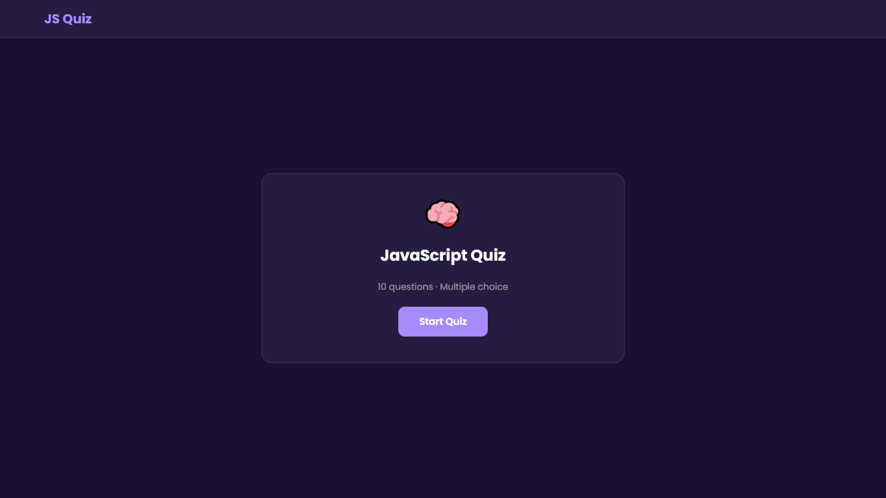
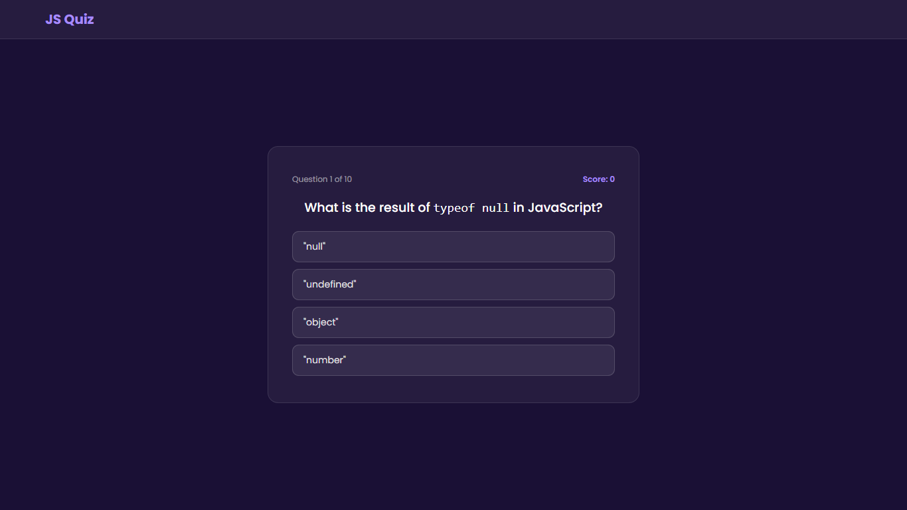
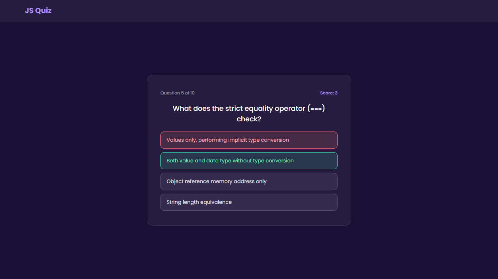
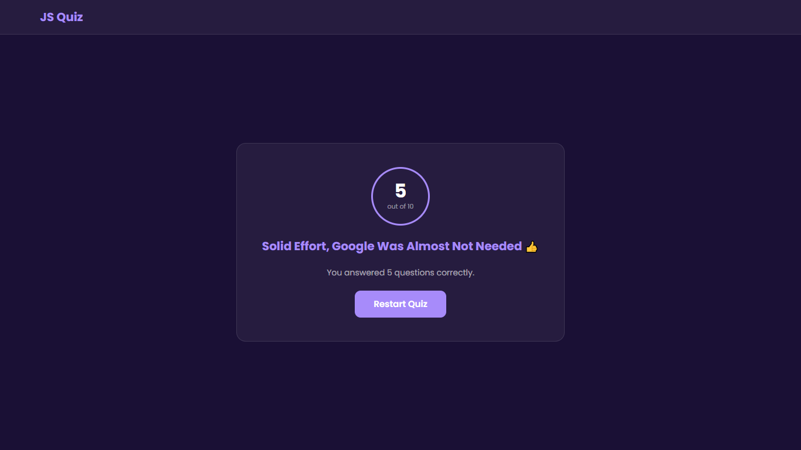

# JS Quiz

A JavaScript knowledge quiz with 10 multiple choice questions,
live score tracking, instant answer feedback, and personality-driven results.

## Live Demo

[https://ifeanyi234.github.io/quiz-js/]

## Screenshots

**Start Screen:**

**Question Screen:**

**Answer Feedback:**

**Results Screen:**

## Features

- 10 JavaScript interview-level questions
- Multiple choice with 4 options per question
- Instant correct/wrong visual feedback on selection
- Live score tracker during the quiz
- Personality-based result labels based on score percentage
- Auto-advances to next question after 2 seconds
- Full restart without page refresh

## Tech Stack

HTML, CSS, JavaScript (no frameworks)

## What I Learned

- Rendering dynamic UI from an array of objects (data-driven rendering)
- Event delegation on a parent container instead of individual buttons
- Using Object.entries() to generate option buttons dynamically
- Locking interactions with a flag variable to prevent double-clicks
- Managing multiple screen states with classList.add/remove("hidden")
- Deriving result labels from score percentage using nested ternary

## Known Limitations

- Questions are fixed — no randomization of order or options
- No timer per question
- No localStorage persistence for high scores

## What I'd Improve With More Time

- Randomize question and answer option order on each attempt
- Add a per-question countdown timer
- Persist and display personal best score across sessions
- Add question categories with a topic selector on the start screen
